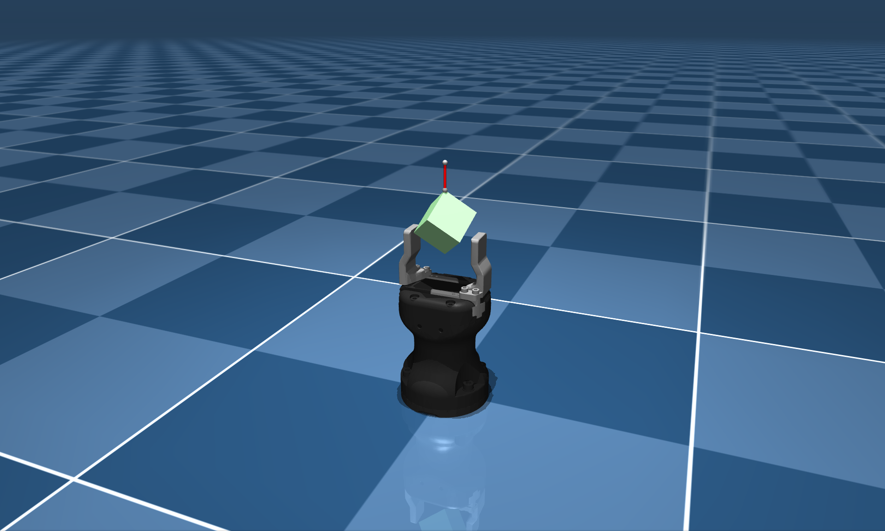

# Robotiq Hande-E Description (MJCF)

Requires MuJoCo 2.2.2 or later.

## Overview

This package contains a simplified robot description (MJCF) of the [Robotiq Hand-E](https://robotiq.com/products/hand-e-adaptive-robot-gripper) developed
by [Robotiq](https://robotiq.com/). It is derived from the [publicly available
URDF
description](https://github.com/cambel/robotiq/blob/noetic-devel/robotiq_description/urdf/robotiq_hand_e.urdf).

  

## URDF → MJCF derivation steps

1. Converted the [Hand-E URDF](https://github.com/cambel/robotiq/blob/noetic-devel/robotiq_description/urdf/robotiq_hand_e.urdf)
   with MuJoCo's `compile` binary and added `<compiler angle="radian" meshdir="assets" autolimits="true"/>`
   to keep the mesh directory local and use radian units.
2. Enabled `implicitfast` integration, `impratio=10`, `noslip_iterations=1`, elliptical cones, and both CCD
   flags in `<option>` to improve contact robustness for the large soft pads.
3. Split repeated joint/actuator settings into nested `<default>` classes (`finger_slide`, `finger_actuator`,
   etc.) so both fingers and future variants share consistent gains, ranges, and damping.
4. Kept the detailed STL meshes for visualization but introduced simplified primitives (stacks of cylinders for
   the palm, boxes for the fingers) in the `collision` and `soft` defaults to get clean, convex collision
   geometry.
5. Tuned the fingertip pads with soft contacts (`solimp`, `solref`, `friction`, and `priority`) to mimic the
   rubber inserts and improved grip stability.
6. Added a `<tendon>` that splits the actuation effort equally between the two slider joints and paired that
   with an `<equality>` constraint to keep their motion mirrored, emulating the real gripper's linkage.
7. Added `scene.xml` which includes the gripper plus the Menagerie ground plane, textured skybox, and a hanging
   box tethered by a tendon for quick inspection.

## License

This model is released under a [BSD-2-Clause License](LICENSE).
